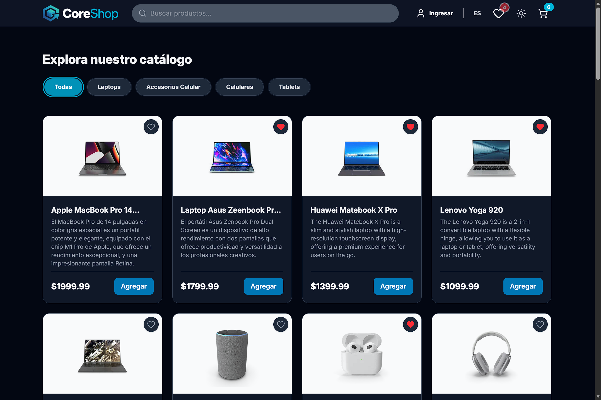
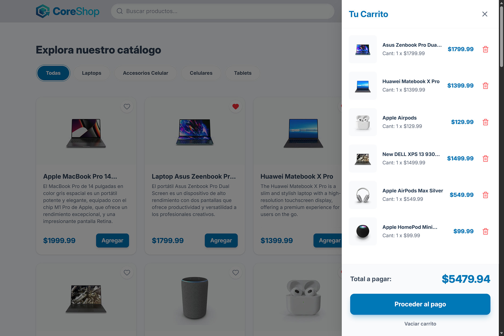

# 🛒 CoreShop - E-Commerce Platform


CoreShop es una plataforma de comercio electrónico moderna, rápida y escalable. Construida con un enfoque estricto en el rendimiento, la experiencia de usuario (UX) y las mejores prácticas de ingeniería de software, incluyendo tipado estricto y pruebas automatizadas.


**[Visita el proyecto en vivo aquí](https://core-shop-project.vercel.app/)** 
---

## Pantallas del Sistema

> **Nota:** Aquí puedes ver cómo luce la plataforma en producción.

| Pantalla Principal | Carrito de Compras |
| :---: | :---: |
|  |  |
| *Vista general de productos con soporte Dark Mode.* | *Gestión de estado global ágil y persistente.* |


---

## Características Principales (Features)

* **Carrito de Compras Persistente:** Gestión de estado global ultra rápida utilizando **Zustand**, con persistencia de datos en `localStorage`.
* **Internacionalización (i18n):** Soporte multi-idioma integrado y optimizado.
* **Autenticación Segura:** Sincronización de estado en tiempo real con **Firebase Auth**.
* **Mobile-First & Cross-Browser:** Optimizaciones específicas para iOS Safari (corrección de status bar, scroll elástico y renderizado de Dark Mode).
* **Tipado Estricto:** Desarrollado 100% en **TypeScript** garantizando la integridad de las interfaces y modelos de datos.
* **CI/CD & Testing:** Integración continua a través de **Vercel** y una suite de pruebas automatizadas configurada con **Vitest**.

---

## Stack Tecnológico

**Core (Núcleo del Proyecto):**
* **React 19:** Biblioteca principal para la construcción de interfaces de usuario.
* **TypeScript:** Superset de JavaScript para garantizar tipado estricto y prevenir errores en tiempo de compilación.
* **Vite:** Entorno de desarrollo ultrarrápido y empaquetador (Bundler) optimizado para producción.

**Gestión de Estado y Navegación:**
* **Zustand:** Manejo del estado global de la aplicación (ligero, rápido y con persistencia de datos).
* **React Router DOM:** Enrutamiento dinámico para una experiencia de Single Page Application (SPA).

**Estilos e Interfaz de Usuario (UI):**
* **Tailwind CSS v4:** Framework de CSS basado en utilidades para un diseño ágil y responsivo.
* **Lucide React:** Sistema de iconografía moderna y escalable.
* **React Hot Toast:** Sistema de notificaciones (toasts) ligeras y accesibles.

**Servicios, Backend e Integraciones:**
* **Firebase:** Backend-as-a-Service (BaaS) utilizado para la autenticación segura de usuarios.
* **i18next & react-i18next:** Sistema robusto para la internacionalización (soporte multi-idioma) con detección automática del navegador.

**Testing y Calidad de Código:**
* **Vitest:** Framework de pruebas unitarias y de integración ultrarrápido (nativo para Vite).
* **ESLint:** Herramienta de análisis estático (Linter) para mantener los estándares y la limpieza del código.
---

## Pruebas Automatizadas (Testing)

Este proyecto incluye una suite de pruebas automatizadas enfocada en la lógica crítica de negocio (Zustand Store) siguiendo el patrón *Arrange, Act, Assert*. 

Para ejecutar las pruebas localmente:
```bash
npm run test
```

## Instalacion local
Si deseas correr este proyecto en tu entorno local, sigue estos pasos:

1.Clona el repositorio:
```bash
git clone [https://github.com/](https://github.com/)[Tu-Usuario]/CoreShop_Project.git
```

2.Instala las dependencias:
```bash
npm install
```

3.Configura tus variables de entorno (Firebase, etc.) en un archivo .env.

4.Inicia el servidor de desarrollo
```bash
npm run dev
```

## Autor
* GitHub: @darthsanz
``